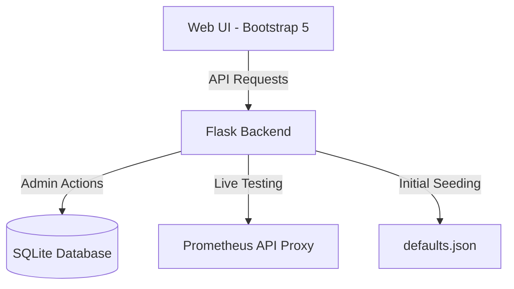

# YamAlert - Managed Prometheus Rule Builder

YamAlert is a powerful, production-ready administrative interface for managing Prometheus alert rules. It provides a complete rule repository with a persistent SQLite backend, real-time validation, and a secure CRUD interface.

## ✨ Key Features

- **🗄️ SQLite Persistence**: Rules are stored in a managed database (`data/rules.db`) for atomic updates and thread safety.
- **🔐 Secure Admin Dashboard**: Password-protected CRUD operations (Add, Edit, Delete) for managing templates directly from the UI, with a Setup Wizard for first use.
- **⚡ Live Prometheus Testing**: Validate your rules against live data from multiple Prometheus instances before saving.
- **📁 Organized Portability**: All data is self-contained in a dedicated `data/` folder, making backup and migration simple.
- **🎨 Modern UI/UX**: Includes a full-height scrollable sidebar, alphabetical sorting, and a suite of premium themes (Glassmorphism, Cyberpunk, etc.).
- **🛠️ Strict Validation**: Multi-layer validation for YAML structure and PromQL syntax on both client and server sides.

---

## 🏗️ Architecture



---

## 🚀 Getting Started

### Prerequisites
- Python 3.8+
- Flask, PyYAML, Requests

### 1. Installation
```bash
git clone https://github.com/lepicodon/yamalert.git
cd yamalert
pip install -r requirements.txt
```

### 2. Environment Variables
Configure the following variables to customize your deployment:

| Variable | Description | Default |
|----------|-------------|---------|
| `SECRET_KEY` | Flask session security key | Required in Prod |
| `PROMETHEUS_URLS`| Comma-separated list of `Name\|URL` pairs | `Local\|http://localhost:9090` |

### 3. Running the App
**Development:**
```bash
python app.py
```

**Production (Gunicorn):**
```bash
export SECRET_KEY="your-random-secret"
gunicorn --bind 0.0.0.0:5000 app:app
```

---

## 📂 Project Structure

- `app.py`: Core Flask application and API.
- `data/`: Contains `rules.db` (SQLite) and `defaults.json` (seed data).
- `static/`: Custom CSS themes and `main.js` (frontend logic).
- `templates/`: Main `index.html` structure.

---

## 🛠️ Usage Guide

1. **Rule Selection**: Use the left sidebar to filter rules by type (Telegraf, VMware, etc.) or search by name/job.
2. **Editor**: View and copy YAML directly. Click **Test Rule** to run the PromQL against a chosen Prometheus instance.
3. **Admin Actions**: 
   - Click the **Admin** button in the top right.
   - Login to reveal **Add**, **Edit**, and **Delete** icons in the sidebar.
   - Any changes to the YAML logic (including group names) are validated and persisted immediately.

---

## 🗺️ Roadmap
- **Semantic Validation**: Integration with `promtool` for deeper rule checking.
- **Audit Logs**: Track history of rule changes and deletions.
- **Visualization**: Mini-graphs for live test results.
- **API Keys**: Support for Bearer token authentication for CI/CD integrations.

---

Developed with ❤️ by the YamAlert Team.
